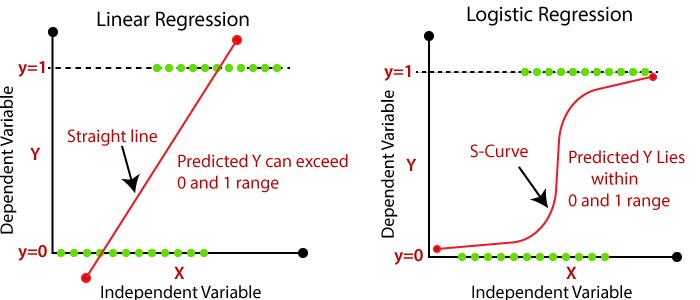

# Neural Networks Basics

## Binary Classification

> **Binary Classification** is a classification task where the goal is to predict the class (output - `y`) of an instance. The class can be either 0 or 1.

## Notation

* `(x, y)` is a training example; `x ∈ R^nx` is the input vector and `y ∈ {0, 1}` is the output;
* `nx` is the number of input features;
* `m` is the number of training examples: `(x^(1), y^(1)), (x^(2), y^(2)), ..., (x^(m), y^(m))`;
* `M = Mtrain` is the training set: `M = {(x^(1), y^(1)), (x^(2), y^(2)), ..., (x^(m), y^(m))}`;
* `Mtest` is the test set: `Mtest = {(xtest^(1), ytest^(1)), (xtest^(2), ytest^(2)), ..., (xtest^(mtest), ytest^(mtest))}`;
* `X` is the matrix of training examples: `X = [x^(1), x^(2), ..., x^(m)]`;
  * `m` columns;
  * `nx` rows;
  * `X ∈ R^(nx x m)`;
* `Y` is the vector of training outputs: `Y = [y^(1), y^(2), ..., y^(m)]`;
  * `m` rows;
  * `Y ∈ R^(1 x m)`;

---

## Logistic Regression

> Logistic Regression is a binary classification algorithm. It is used to predict the probability that an instance belongs to a particular class.

  

Given `x`, want to predict `ŷ = P(y = 1 | x)`. The logistic function is used to map the output of the linear regression to a value between 0 and 1.

* **Input**: `x ∈ R^nx` is the input vector;
* **Parameters**: `w ∈ R^nx` and `b ∈ R`;
* **Output**: `ŷ = σ(w^Tx + b) = σ(z)`, where `z = w^Tx + b` and `σ(z) = 1 / (1 + e^-z)`.

> **Note**: `σ(z)` is the sigmoid function. We use the sigmoid function because it is a **non-linear function** and it maps the output of the linear regression (`z`) to a value between 0 and 1.

* **Loss (error) function**: `L(ŷ, y) = -(y log(ŷ) + (1 - y) log(1 - ŷ))`;

### Cost Function

> The cost function is used to **measure the performance of the model**. It is the average of the loss functions of the training examples.

`J(w, b) = 1/m * Σm i=1 L(ŷ^(i), y^(i)) = -1/m * Σm i=1 (y^(i) log(ŷ^(i)) + (1 - y^(i)) log(1 - ŷ^(i)))`
